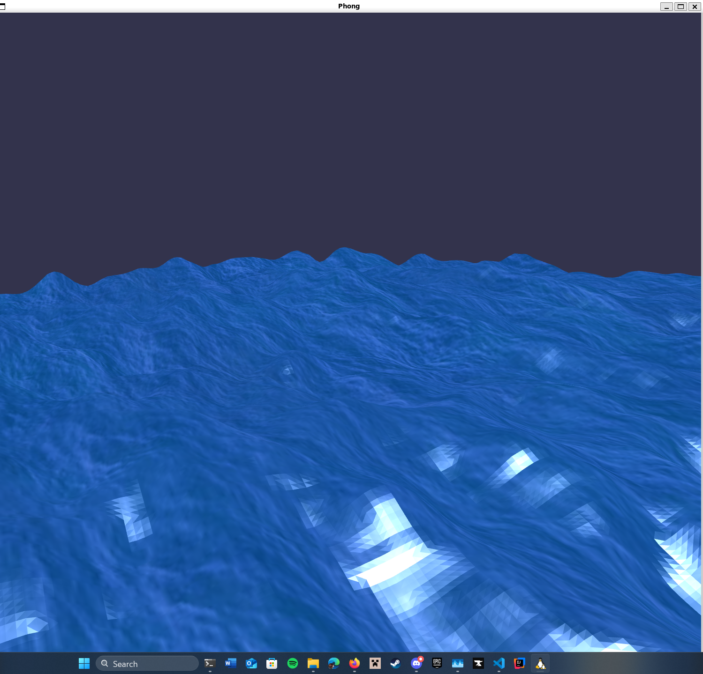
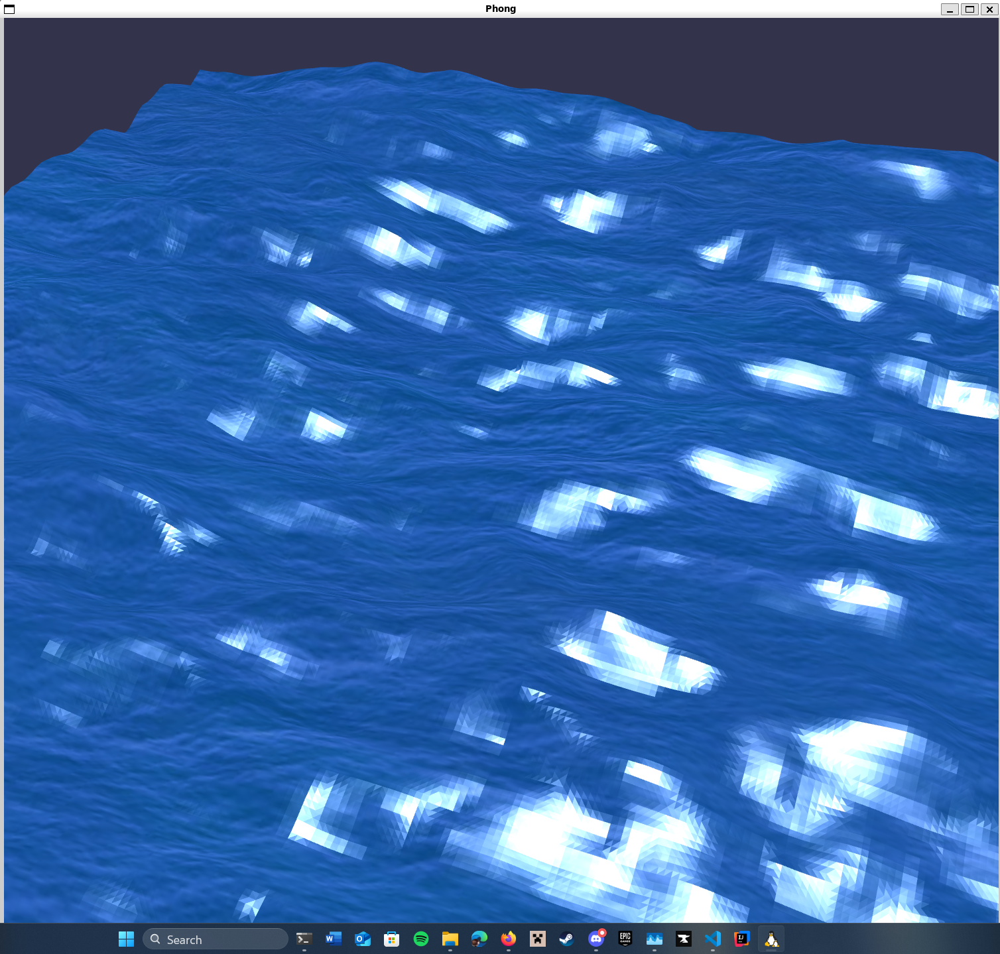

# Gerstner Waves Water Shader


## Project Overview

In this project I tackled shader programming techniques, including tessellation, geometry shaders, and displacement mapping, to realistically simulate water waves using Gerstner wave principles...

All in OpenGL with C++!

Plus a cheeky Phong lighting model my professor would (hopefully) be proud of 😉.

## Features and Accomplishments

- **Tessellation Shaders**: Utilized Tessellation Control and Evaluation Shaders to dynamically refine a basic quad mesh into a detailed, high-resolution surface suitable for realistic wave simulation.

- **Geometry Shader & Gerstner Waves**: Implemented a geometry shader that computes the superposition of multiple Gerstner waves, accurately simulating natural wave patterns and behaviors over time.

- **Displacement Mapping**: Enhanced realism through displacement maps, adding depth and detailed textures to wave surfaces.

- **Phong Lighting Model**: Implemented a Phong-like reflection model in the fragment shader, calculating ambient, diffuse, and specular lighting components to produce realistic reflections and highlights.

## What I Learned

- Advanced usage of the OpenGL shader pipeline (Tessellation and Geometry shaders).
    - This was very daunting until this project - going through the motions (+ this [incredible series by Jamie King](https://www.youtube.com/watch?v=6c1QYZAEP2M&list=PLRwVmtr-pp06qT6ckboaOhnm9FxmzHpbY)) taught me so so much.
- Application and mathematical modeling of waves through Gerstner wave functions.
- Implementation of realistic lighting and shading models.
    - I'm still learning so at first it was especially difficult but I got the hang of it. VAOs, VBOs, EBOs, ... all of the above.
- Optimization techniques for dynamic mesh generation and manipulation.
    - Spent an embarassing amount of time doing this for no reason everything was already running great on my pc.

## Gerstner Wave Functions

> Gerstner wave functions are a mathematical model used to simulate realistic water waves. They describe the motion of water as a combination of sinusoidal waves, allowing for the creation of complex and natural-looking wave patterns. 

In this project, the geometry shader applies multiple Gerstner wave functions to manipulate the vertices of the tessellated mesh dynamically.

### How It Works in the Code

Each wave is defined by parameters such as frequency (`w`), amplitude (`A`), phase (`phi`), sharpness (`Q`), direction (`D`), and an exponent (`N`) that controls the influence of sharpness. These parameters allow for fine-tuning the behavior and appearance of each wave.

In the geometry shader ([geo.glsl](shaders/geo.glsl)), the `Gerstner` function computes the displacement of each vertex based on its world position. The displacement includes horizontal (x, z) and vertical (y) components, creating realistic wave motion.

Multiple Gerstner waves are combined to simulate the interaction of different wave patterns. This is achieved by summing the displacements from several calls to the `Gerstner` function, each with unique parameters.

The `time` uniform (glfwTime just cast to a float) is used to animate the waves, making them evolve smoothly over time. This creates the illusion of flowing water.

The Gerstner wave displacements are added to the base displacement from the texture map (`distext`), further enhancing the realism of the water surface.

After all that the project simulates water waves that respond dynamically to time and lighting.

## Compilation Instructions

To compile and run this project:

1. Ensure that you have `GLEW`, `GLFW` and `GLM` installed.
2. Compile with:

```bash
make water
```

3. Compile and run with
```bash
make
```

> I know this isn't best practice but this is just a scratch pad to learn - I have exams haha.

## Known Issues

- No significant bugs are present. Minor graphical artifacts might occur at extreme zoom.


